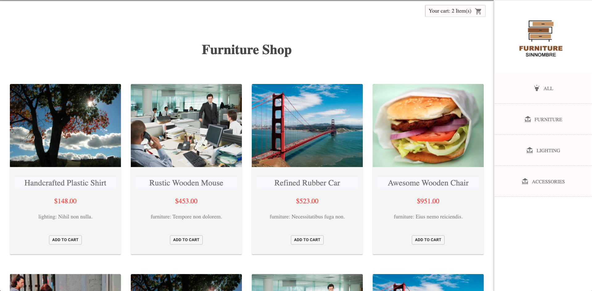

# React Store

[Different data src]

This project was bootstrapped with [Create React App](https://github.com/facebook/create-react-app).


### How-to :card_index:

Download repository, install dependencies and type `npm start`

### Start
- `npm start` opens in browser:
  + `localhost:3000` [client]
  + `localhost:4000` [server]


### Folders
- redux [actions,reducers,store,types]
- shop [shopConnector & components: index.js,styles.scss, ]
- server `localhost:4000/api/products`


### Functionality so far

• Products  `/shop/products`
- categories/data filtered-by, right-side menu
- click a product [add-to-cart] button & goto `/shop/cart`
- [cart badge] upper-right side, displays items currently on cart
- click [cart-icon] svg, it routes to `/shop/cart`


• Cart `/shop/cart`

- update quantity, it updates total
- remove item, it updates total
- option to [continue-shopping] button (back to `/shop/products`) || [proceed to checkout]
  button `/shop/checkout`


### Data

```
  @ json-server
  =============

  @url => http://localhost:4000/api/products?
  @param => category
  @param => _page
  @param => _limit
  @param => _sort

  # filter by param
  # ex: http://localhost:4000/api/products?_page2&_limit=20&_sort=name

```


```
  @ faker-data
  ============

    ø Categories
      -----------
      • furniture
      • lighting
      • accessories

    ø Products
      ------------
      • id <number>
      • name <string>
      • image <string>
      • category <string>
      • description <string>
      • price <number>


  @ routes
  ========
  • /shop/products/:category
  • /shop/products/cart
  • /shop/produts/checkout
  • /shop/products/:category/:id
  • /shop/products/all <redirect>
  • /shop/products/:category/:id  (details page)

```


#### Moved data to GCFirebase

- Need to redo pagination


<br />
<hr />
<br />

<kbd>screenshot</kbd>



<br/>


### firebase GCP functions
(production)

- deployed fb functions
- endpoints:

```
  app.get("/shop/products/all", getProducts );

  app.get("/shop/products/:category/:id", getProduct);

  app.get("/shop/categories/all", getCategories);

  app.get("/shop/cart", getCart);

  app.post("/shop/product", createProduct);

```


<br />
<br />

<hr />


```

 Options -MultiViews
RewriteEngine On
Rewritecond %{REQUEST_FILENAME} !-f
RewriteRule ^ index.html [QSA,L]

```
